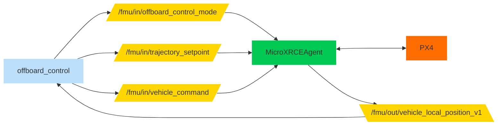

# offboard_control node: topics

Topics published and subscribed by the `offboard_control` node (M1).

```mermaid
flowchart LR
    n1["offboard_control"] --> n2["/fmu/in/offboard_control_mode"] & n4["/fmu/in/trajectory_setpoint"] & n5["/fmu/in/vehicle_command"]
    n2 & n4 & n5 --> n6["MicroXRCEAgent"]
    n6 <--> n8["PX4"]
    n6 --> n7["/fmu/out/vehicle_local_position_v1"]
    n7 --> n1

    n1@{ shape: proc}
    n2@{ shape: in-out}
    n4@{ shape: in-out}
    n5@{ shape: in-out}
    n6@{ shape: proc}
    n7@{ shape: out-in}
    n8@{ shape: proc}
    style n1 fill:#BBDEFB,stroke-width:0px
    style n2 fill:#FFD600,stroke-width:0px
    style n4 fill:#FFD600,stroke-width:0px
    style n5 fill:#FFD600,stroke-width:0px
    style n6 fill:#00C853,stroke-width:0px
    style n7 fill:#FFD600,stroke-width:0px
    style n8 fill:#FF6D00,stroke-width:0px
```
